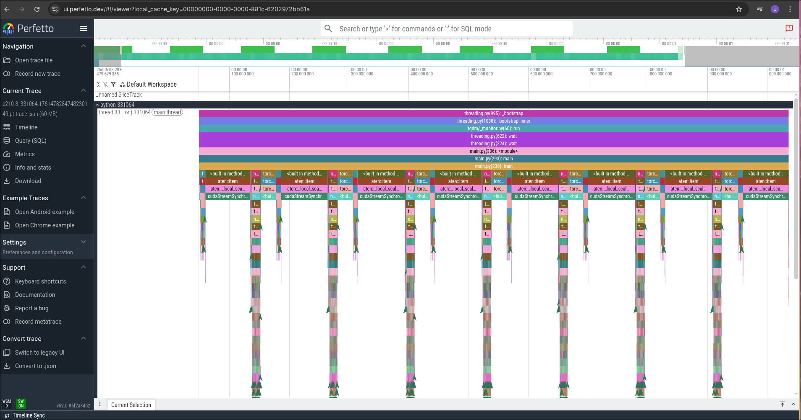
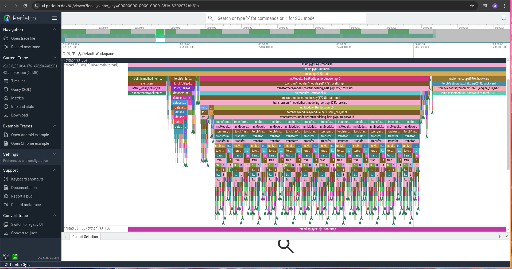
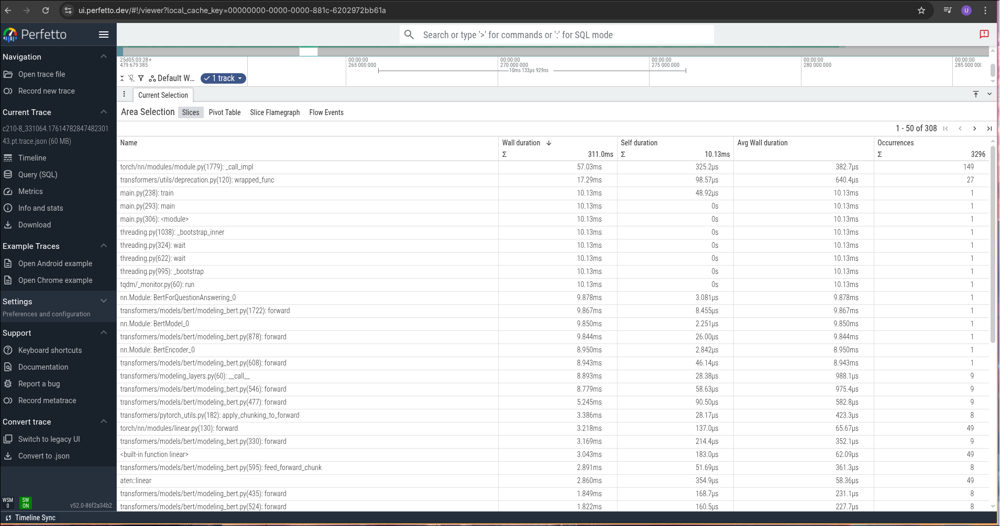
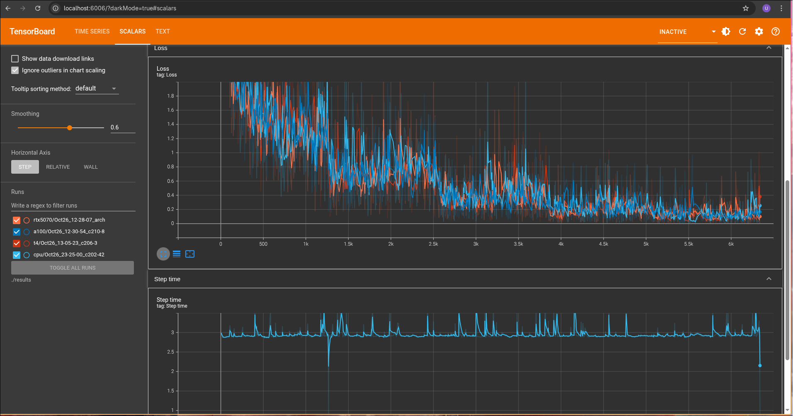
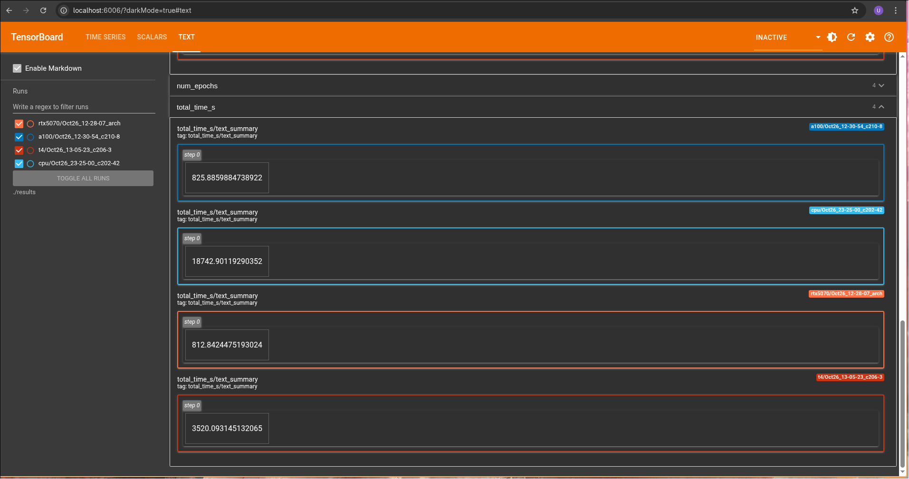

# BASELINE (Gonzalo Silvade and Unai Iborra)

## Profiling y visualización de métricas con tensorboard
Para realizar el profiling del entrenamiento se ha utilizado la clase torch.profiler.profile(). Ésta permite analizar con detalle las llamadas a función y etapas del modelo, uso de CPU, GPU, memoria, etc.

Se han definido los siguientes tres parámetros para facilitar la configuración del profiling en el método train():
    1. profiler=None,
    2. save_profiler_time_table: bool = False,
    3. save_tensorboard_metrics: bool = False,

El parámetro "profiler" permite definir el profiler deseado para el entrenamiento según se defina la clase torch.profiler.profile(). El parámetro save_profiler_time_table” permite al entrenamiento guardar en formato tabla los resultados del profiling, ordenados según el tiempo tardado en ejecutar CUDA por cada parte de la ejecución del entrenamiento.

El parámetro "save_tensorboard_metrics" permite guardar para una futura visualización con tensorboad: 
    1. Los "losses", "step times" y "learning rates" de cada step en formato escalar
    2. El tiempo total, pérdida final, batch size y número de épocas.

Para ejecutar fácilmente el servidor de tensorboard se ha creado el script /scripts/start_profiling_srv.sh (se ha configurado para visualizar los resultados de todos los entrenamientos realizados)

Se ha preparado el código para correr con las siguiente configuración de profiling:
    La configuración establecida utiliza un profiler que sigue el siguiente "schedule":  schedule(wait=2, warmup=100, active=8, repeat=1). Esto indica al profiler que omita los primeros 2 steps, que haga profiling de los siguientes 100 pero no utilice ni guarde sus resultados (inicializar el profiler causa una bajada de rendimiento significativa según la documentación por lo que se recomienda utilizar warmup en el profiler para resultados más fiables). Finalmente se realiza el profiling de los 8 siguientes steps. Esta configuración guarda tanto los resultados del profiling en formato tabla, como en json para visualización mediante perfetto. La decisión de realizar profiling en únicamente 8 steps ha sido tomada debido a que en pruebas de profiling de todo el entrenamiento, el entrenamiento finalizaba por falta de memoria a la hora de guardar los datos, y en los casos de entrenamientos con menos epochs, el entrenamiento sí acababa pero los resultados del profiling ocupaban decenas de gigabytes. Aunque el profiling no se realiza a lo largo de todo el entrenamiento, los resultados obtenidos son representativos y permiten identificar las secciones más costosas en tiempo y recursos. Además debido a este schedule, los resultados de tiempo total de la tabla de métricas de profiling no coincidirá con los resultados de entrenamiento real (el resultado de la tabla es el tiempo total de entrenamiento con profiling aplicado).

Se ha explorado la opción de visualizar los resultados del profiling mediante tensorboard pero no se ha podido realizar dado que esta funcionalidad ha sido deprecada según la documentación de pytorch (https://docs.pytorch.org/tutorials/intermediate/tensorboard_profiler_tutorial.html). La documentación indica que se debe utilizar perfetto para la visualización del profiling.

## Resultados de los entrenamientos

El modelo ha sido entrenado en diferentes hardwares con la finalidad de observar las diferencias de tiempo y recursos entre ellos:
    1. Nvidia A100 GPU
    2. Nvida Tesla T4 GPU
    3. Nvidia RTX5070 GPU
    4. Intel Xeon Ice Lake 8352Y CPU (with 64 threads)

Los resultados de dichos entrenamientos han sido los siguientes para un entrenamiento de 5 epochs (1268 steps por epoch, 6340 steps totales):

### Nvidia A100 GPU
Tiempo total (5 epochs): 826s (~14 minutos)
Loss final: 0.13723315061081043

### Nvida Tesla T4 GPU
Tiempo total (5 epochs): 3520s (~59 minutos)
Loss final: 0.12958095948443576

### Nvidia RTX5070 GPU
Tiempo total (5 epochs): 812s (~14 minutos)
Loss final: 0.14979120969766097

### Intel Xeon Ice Lake 8352Y CPU (with 64 threads)
Tiempo total (5 epochs): 18742s (~312 minutos)
Loss final: 

Se puede observar un gran cambio de rendimiento entre ejecución en GPU frente a ejecución en CPU, como es de esperar.
Respecto a las diferencias entre las ejecuciones de GPU, se puede observar un rendimiento notablemente superior en la A100 y RTX5070 frente a la Tesla T4. Este rendimiento es lógico considerando la capacidad de procesamiento y núcleos Cuda de cada GPU.

Se concluye que el speedup con las gráficas A100 y RTX5070 es de aproximadamente 23 frente a la ejecución en CPU y de aproximadamente 4 frente a la Tesla T4.

### Perfetto
Respecto al profiling de los entrenamientos, se han visualizado los resultados del profiling mediante la web perfetto. En la siguiente imágen se puede observar la vista global de las distintas etapas del entrenamiento en un dashboard global (A100):

En la siguiente imágen se puede observar la misma vista global de la imágen anterior pero enfocando el área de visualización en un rango de steps menor para observar con mas detalle las distintas llamadas a funciónes del modelo:

En la siguiente imágen se puede observar una tabla de tiempos y más datos de cada llamada a función del profiling:

### Tablas de profiling
Puesto que no se ha podido visualizar el profiling en tensorboard por estar deprecado en pytorch, se ha optado por guardar una tabla en formato texto de las filas más costosas en tiempo de CUDA. Se pueden observar en la tabla los siguientes campos: 
- Name
- Self CPU %
- Self CPU
- CPU total %
- CPU total
- CPU time avg
- Self CUDA
- Self CUDA %
- CUDA total
- CUDA time avg
- CPU Mem
- Self CPU Mem
- CUDA Mem
- Self CUDA Mem
- N of Calls

Los resultados de los entrenamientos de cada gpu en este formato tabla se pueden observar en la carpeta /results/{hardware}/profile/profiler_summary.txt

### Visualización de métricas escalares mediante tensorboard
Se muestran a continuación las imágenes de las métricas escalares guardadas para visualizar con tensorboard.

Además se han guarado datos sobre datos sobre el tiempo total de ejecución, epochs, loss final y batch size visualizables mediante tensorboard:

